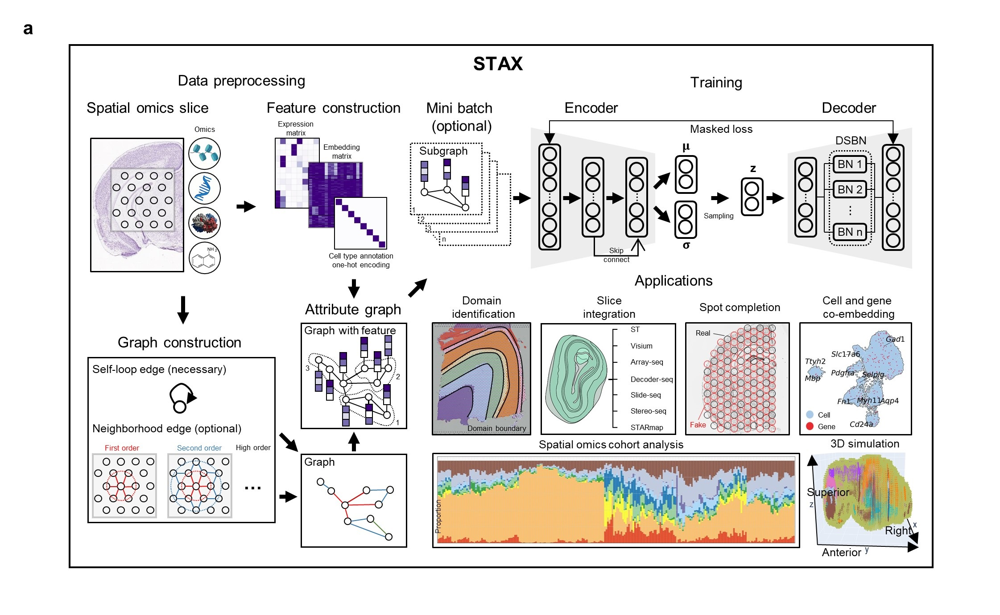

# STAX

## Overview

The rapid advancement of spatial omics technology has revolutionized biomedical research, unveiling unprecedented 
insights into the molecular and cellular architecture of biological systems. However, despite its transformative 
potential, the analysis of spatial omics data presents significant computational and analytical challenges. To address 
these hurdles, we introduce STAX—an innovative, lightweight, and multi-task Graph Attnetion Network (GAT) framework 
designed to unify diverse analytical tasks within a single computational platform. STAX excels across numerous critical 
applications, including spatial domain identification, spatial slice integration, cohort-level spatial analysis, spatial 
spot completion, cell-gene co-embedding, expression profile denoising, and 3D spatial multi-slice simulation. Extensive 
evaluations demonstrate that STAX consistently delivers superior performance, robustness, and biologically meaningful 
interpretations, establishing it as an indispensable tool for spatial omics research. As a versatile and computationally 
efficient framework, STAX effectively overcomes multiple analytical challenges in spatial omics, empowering researchers 
with a powerful platform to accelerate biomedical discoveries and deepen our understanding of complex biological systems. 



## Doc

TODO

## Prerequisites

### Data

The data can be download in [google driver](https://drive.google.com/drive/folders/18tcl-PRdK9j-W59GUPdsKgy_04IJvz05)

The URL is: https://drive.google.com/drive/folders/18tcl-PRdK9j-W59GUPdsKgy_04IJvz05

### Environment

#### Declaration: All of our experiments were implemented in Windows 10 and python311 environment. We also provide a linux ubuntu 22.04 installation pipeline, but the linux results are not exactly consistent with the Windows 10 results. One variation of result can be seen in Epigenomics mouse_brain_dataset_1 in tutorial1. This may be due to differences in numpy's underlying math libraries or compilers used across the two systems.

It is recommended to use a Python version  `3.11`.

* Set up conda environment for STAX:

```
conda create -n STAX python==3.11
```

* Activate STAX environment:

```
conda activate STAX
```

* We found that conda installation can be slow sometimes, so we used pip installation here. The official pip and conda command and other versions of pytorch and dgl can be found from
[torch](https://pytorch.org/) and [dgl](https://www.dgl.ai/pages/start.html).
* You need to choose the appropriate dependency pytorch and dgl for your own environment, and we recommend the 
  pytorch==2.1.2+cu118 and dgl==2.2.1+cu118:

Windows:

* For torch:
```
pip install torch==2.1.2 torchvision==0.16.2 torchaudio==2.1.2 --index-url https://download.pytorch.org/whl/cu118
```
* For dgl:

The official install command can be found at https://www.dgl.ai/pages/start.html, but we can not install dgl by it.
In another way, we use the whl file to install dgl. We can find these files at https://data.dgl.ai/wheels/repo.html.
Which whl file you choose depends on your current environment. For cuda11.8 and python3.11 in windows, please select 
dgl-2.2.1+cu118-cp311-cp311-win_amd64.whl. We also uploaded this file to 
https://drive.google.com/drive/folders/18tcl-PRdK9j-W59GUPdsKgy_04IJvz05
Once the whl file is downloaded, 'cd' to the directory and pip install it. For example, 
```
pip install dgl-2.2.1+cu118-cp311-cp311-win_amd64.whl
```

Linux ubuntu 22.04:

* For torch:
```
pip install torch==2.1.2 torchvision==0.16.2 torchaudio==2.1.2 --index-url https://download.pytorch.org/whl/cu118
```
* For dgl:

The official install command can be found at https://www.dgl.ai/pages/start.html, but we can not install dgl by it.
In another way, we use the whl file to install dgl. We can find these files at https://data.dgl.ai/wheels/torch-2.1/cu118/repo.html.
Which whl file you choose depends on your current environment. For cuda11.8 and python3.11 in windows, please select 
dgl-2.2.1+cu118-cp311-cp311-manylinux1_x86_64.whl. We also uploaded this file to 
https://drive.google.com/drive/folders/18tcl-PRdK9j-W59GUPdsKgy_04IJvz05
Once the whl file is downloaded, 'cd' to the directory and pip install it. For example, 
```
pip install dgl-2.2.1+cu118-cp311-cp311-manylinux1_x86_64.whl
```

#### In addition, if you want to use the mclust clustering algorithm in R, install R first. 
```
conda install -c conda-forge r-base==4.2.0
```
Then use the command to install rpy2.
```
conda install rpy2 
```
Finally, install r-mclust
```
conda install -c conda-forge r-mclust
```

## Installation

Then you can install STAX as follows:

```
git clone https://github.com/zhanglabtools/STAX.git
cd STAX
python setup.py bdist_wheel sdist
cd dist
pip install STAX-0.0.1-py3-none-any.whl
```

If you have existed python environment, you can directly download the STAX package and try to import STAX in your code.
It may work, but we can't guarantee it

## Set up your jupyter lab

Once you have configured your STAX environment using conda. Add STAX to jupyter's core. 

Specifically, we have installed ipykernel automatically through STAX, if it does not install successfully, 
please enter the following command.
```
pip install ipykernel
```
Then enter the following command:
```
python -m ipykernel install --user --name=STAX --display-name STAX
```

## Tutorials

The following are detailed tutorials. All tutorials were carried out on a notebook with a 11800H cpu and a 3070 8G gpu.

1. [1_STAX outperforms state-of-the-art (SOTA) methods in benchmark datasets for single-omics spatial domain identification](./Github_Tutorials/1_STAX_single_slice.ipynb)
2. [2_STAX accurately identifies spatial domains across different techniques, resolutions, and scale](./Github_Tutorials/2_STAX_multi_slice.ipynb)
3. [3_STAX enables integration of spatial omics cohort across hundreds of individuals](./Github_Tutorials/3_STAX_cohort.ipynb)
4. [4_STAX achieves spot completion while deciphering the complex tumor microenvironment](./Github_Tutorials/4_STAX_spot_completion.ipynb)
5. [5_STAX pinpointed cell type, domain type, and disease-related specific genes in cell and gene co-embedding](./Github_Tutorials/5_STAX_cell_gene_coembedding.ipynb)
6. [6_STAX generates high-resolution 3D point cloud of the mouse embryo brain and simulates coronal, sagittal, and transverse slices](./Github_Tutorials/6_STAX_generate_high_resolution_3D_point_cloud.ipynb)

## Citations
If you find this method useful for your research, consider citing the following papers:
```
STAX: Exploring spatial omics data with multi-task graph attention networks
```